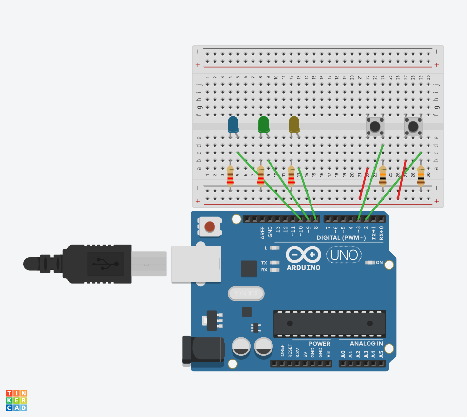

# interrupt_counter
-------------------

LED's are connected to port B. 
When the push button connected to port 2 (PB2/ INT0) is pressed, The counter will increase and the LED's will show the new output in binary.
When the push button connected to port 3 (PB3 / INT1) is pressed, the counter will decrease and the LED's will show the new output in binary

